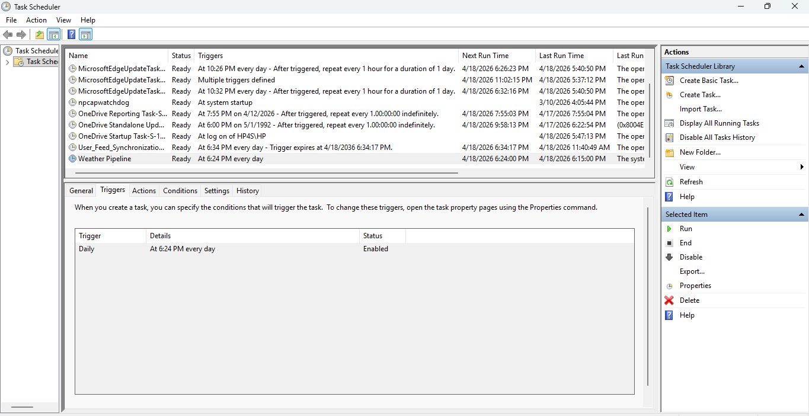

# Automation Setup

This ETL pipeline is automated using Windows Task Scheduler. The pipeline runs a Python script through a batch (.bat) file.

## How Automation Works

1. A batch file (`run_pipeline.bat`) executes the pipeline.
2. The batch file:
   - Navigates to the project directory
   - Runs `main.py`
3. Task Scheduler triggers the batch file at a scheduled time

## Batch File (run_pipeline.bat)

```bat
@echo off
cd /d "D:\Weather ETL pipeline"
python main.py
pause
```

## Task Scheduler Setup

- **Trigger**: Daily
- **Action**:
  - Program/script: `cmd.exe`
  - Arguments: `/c "D:\Weather ETL pipeline\run_pipeline.bat"`
  - Start in: `D:\Weather ETL pipeline`

### Conditions
- Disabled "Run only on AC power"

## Testing

Manual test:
```bash
schtasks /run /tn "Weather Pipeline"
```

## Evidence

