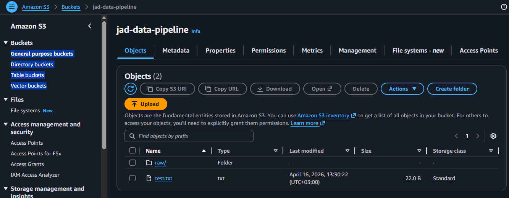
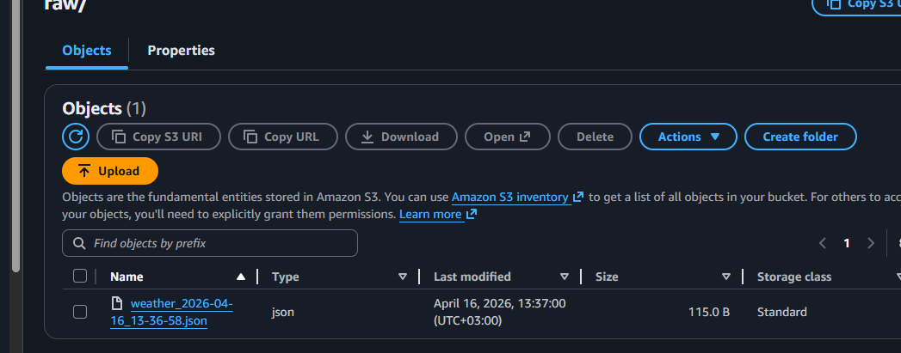
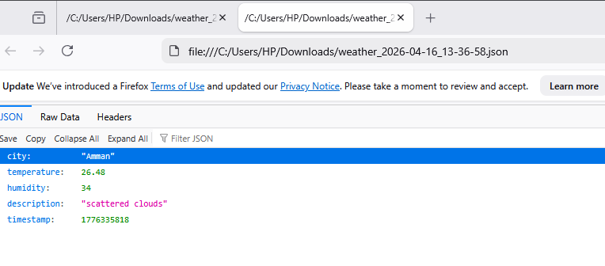

# AWS S3 Integration – Data Storage Layer

## Overview

This project uses Amazon S3 as a data lake to store raw API data before processing.

The goal is to demonstrate a real-world data engineering architecture with separation between raw and processed data.

---

## Architecture

API → S3 (Raw Layer) → Transformation → PostgreSQL (Processed Layer)

---

## S3 Configuration

* Bucket Name: `jad-data-pipeline`
* Region: us-east-1
* Folder Structure:

```
raw/
  weather_YYYY-MM-DD_HH-MM-SS.json
```

---

## Raw Data Storage

The pipeline stores raw API responses as JSON files in S3.

Example:

```
raw/weather_2026-04-16_13-36-58.json
```

---

## Authentication

Access to AWS S3 was configured using an IAM user with programmatic access.

Permissions were restricted to S3 operations following the principle of least privilege.

Credentials are not included in this repository for security reasons.

---

## Upload Implementation (Python)

```python
import boto3
import json
from datetime import datetime

def save_raw_to_s3(data):
    s3 = boto3.client('s3')

    bucket_name = 'jad-data-pipeline'
    timestamp = datetime.now().strftime("%Y-%m-%d_%H-%M-%S")

    key = f"raw/weather_{timestamp}.json"

    s3.put_object(
        Bucket=bucket_name,
        Key=key,
        Body=json.dumps(data),
        ContentType='application/json'
    )
```

---

## Evidence

### S3 Bucket



### Raw File in S3



### JSON Output



---

## Key Concepts Demonstrated

* Data Lake using S3
* Raw vs Processed data separation
* Timestamp-based partitioning
* Cloud integration with boto3
* Scalable pipeline design

---

## Note

The S3 bucket was used for demonstration purposes only and may be deleted to avoid unnecessary costs.

The architecture remains valid and can be scaled for production use.
